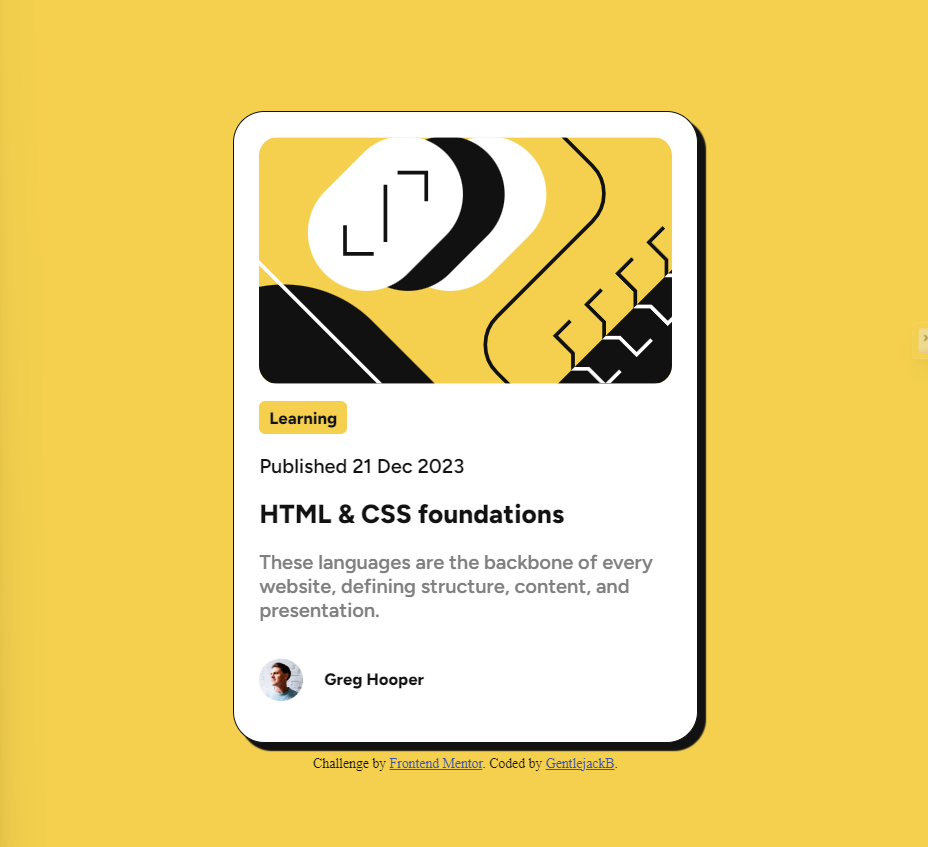

# Frontend Mentor - Blog preview card solution

This is a solution to the [Blog preview card challenge on Frontend Mentor](https://www.frontendmentor.io/challenges/blog-preview-card-ckPaj01IcS). Frontend Mentor challenges help you improve your coding skills by building realistic projects.

## Table of contents

- [Overview](#overview)
  - [The challenge](#the-challenge)
  - [Screenshot](#screenshot)
  - [Links](#links)
  - [Built with](#built-with)
  - [What I learned](#what-i-learned)
- [Author](#author)
- [Acknowledgments](#acknowledgments)

## Overview

### The challenge

Users should be able to:

- See hover and focus states for all interactive elements on the page

### Screenshot



### Links

- Solution URL: [Add solution URL here](https://your-solution-url.com)

### Built with

- Semantic HTML5 markup
- CSS custom properties
- Flexbox
- Mobile-first workflow

### What I learned

i learnt about CSS font variables.

Some css code I'm proud of

```css
@font-face {
  font-family: myFirstFont;
  src: url(./assets/fonts/static/Figtree-ExtraBold.ttf);
  font-weight: 800;
}
```

## Author

- Website - [Fagbemi Collins](https://fagbemiilemobayo.vercel.app)
- Frontend Mentor - [@sirGentlejack](https://www.frontendmentor.io/profile/sirGentlejack)
- Twitter - [@gentlejack](https://www.twitter.com/gentlejack_b?s=21)
